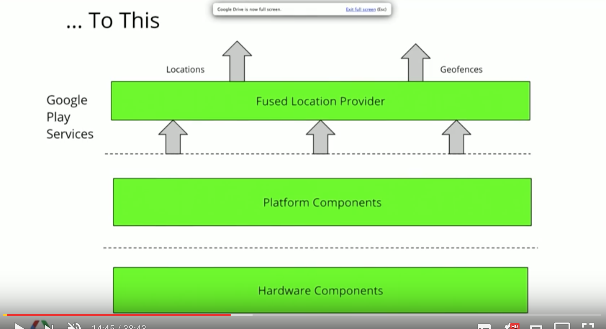
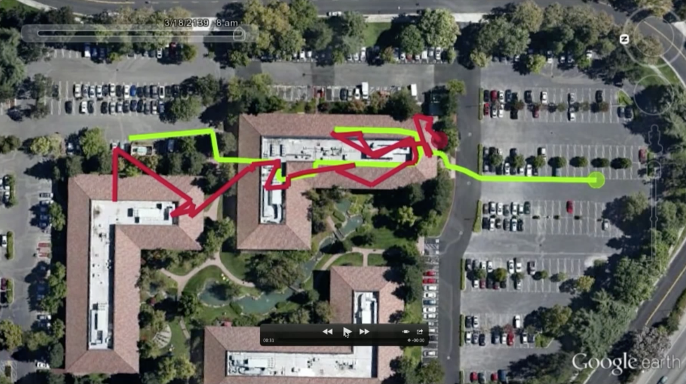
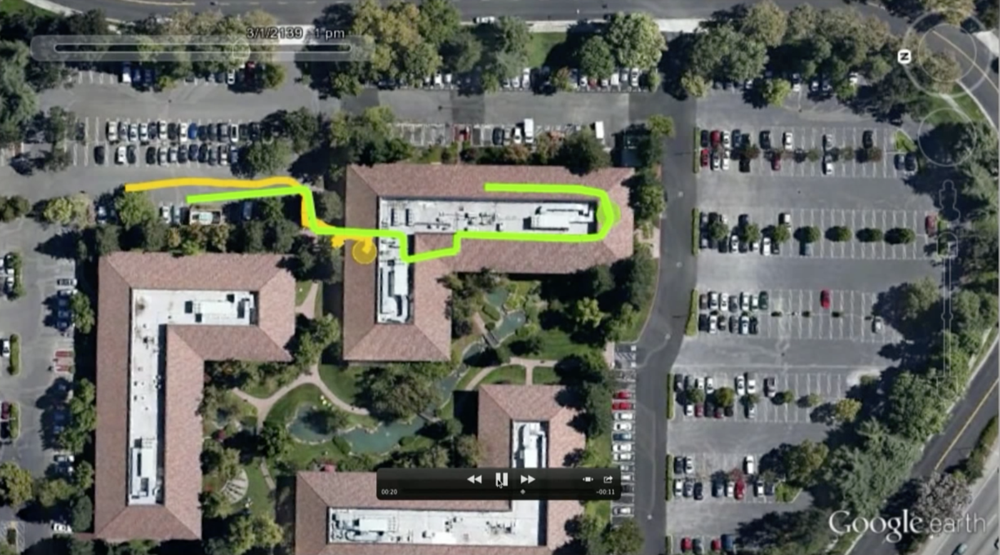

# 우리에게 필요한 Location API는 무엇인가?

> Fused Location API !!

## 구글의 Location Service API (일명 Fused Location Provider)

Google I/O 2013 에서 소개된 [Fused Location Provider](https://www.youtube.com/watch?v=URcVZybzMUI) (이하 Fused API)의 내용을 보면, 새로운 Location Provider 에 대해 기존 플랫폼 Location API(이하 플랫폼 API) 대비 다음과 같은 효과를 얻을 수 있다고 합니다.

> Goals of the Changes
* Reduce Power 
* Improve accuracy
* Simplify the APIs
* Expose cool new features
* and make it available on most Android devices

사실 이 동영상을 보고 난 후, API 선택에 대한 고민을 더해야 하나 생각이 들었습니다. (이 동영상을 조금 늦게 봤습니다..)
Fused API는 다양한 프로바이더에서 제공하는 위치 정보들을 개발자가 어렵게 계산하지 않고, 
하나의 요청과 결과로 쉽게 위치를 얻어낼 수 있습니다. 

그림 1 플랫폼 API에서 위치 수신 (프로바이더로 부터 그대로 위치값을 받는다.)


그림 2 Fused API에서 위치 수신 (통합된 위치 수신)



아래는 플랫폼 API와 Fused API 로 위치 트래킹하여 비교한 결과입니다. (동영상 캡쳐) 

그림 3 네트워크 프로바이더만 사용한 경우 (플랫폼 API)


그림 4 GPS 프로바이더만 사용한 경우 (플랫폼 API)


그림 5 Fused API를 사용한 경우


Fused API에서 얻은 결과가 위치 추적이 가장 잘 이루어지고 있음을 보여주고 있습니다.


Android Developers 사이트의 [Location Strategies](https://developer.android.com/guide/topics/location/strategies.html) 페이지를 보면 플랫폼 패키지 android.location 에 속한 Location API (이하 플랫폼 API)를 활용하는 방법이 소개되고 있습니다. 이 페이지의 서두에 Google Play Services 에 속한 Google Location Services API (이하 Fused API)는 기본 플랫폼 API보다 저전력이면서 위치의 정확도를 향상시키고 사용하기 간편하다고 소개하고 있습니다.

> The Google Location Services API, part of Google Play Services, provides a more powerful, high-level framework that automatically handles location providers, user movement, and location accuracy. It also handles location update scheduling based on power consumption parameters you provide. In most cases, you'll get better battery performance, as well as more appropriate accuracy, by using the Location Services API.
 


### Provider 

위치 정보를 제공하는 대상으로 다음 종류의 프로바이더가 있습니다.

* GPS_PROVIDER - 가장 정확한 위치를 얻을 수 있으나 상대적으로 느리고, GPS 수신이 가능한 외부에서만 동작합니다. 배터리 사용을 가장 많이 하게 됩니다. 플랫폼 소스 [LocationManagerService](https://github.com/android/platform_frameworks_base/blob/master/services/core/java/com/android/server/LocationManagerService.java) 전반에서 GPS 프로바이더는 High Power Request 로 분리해서 관리하고 있습니다.

* NETWORK_PROVIDER - 모바일 셀룰러 데이터 타워의 위치나 WiFi의 Access Point 를 통해 위치를 얻습니다. 전화만 가능한 상황이라면 거의 모든 상황에서 위치를 제공받을 수 있지만, GPS에 비해 정확도가 떨어집니다.

* PASSIVE_PROVIDER - 다른 앱이나 서비스에서 위치정보를 요청할 경우, 위치 정보를 얻게 됩니다. 빠른 위치 정보 업데이트가 필요없는 경우 사용하게 되면 자신의 앱 때문에 배터리가 급격히 소모되는 일은 없게 됩니다. 

* FUSED_PROVIDER - [LocationManager](https://github.com/android/platform_frameworks_base/blob/master/location/java/android/location/LocationManager.java) 에서 숨김처리 되어 있고, Fused API에서 제공하는 정보임을 명시합니다. 사용자 요청 설정값(Proirity)에 따라 GPS 또는 NETWORK 프로바이더로부터 얻은 데이터를 조합하여 데이터를 제공합니다.


## 플랫폼 API - LocationManager 요청 처리

플랫폼 API로 위치 정보를 수신하려면 아래와 같이 `LocationManager`에 [requestLocationUpdates](https://github.com/android/platform_frameworks_base/blob/master/location/java/android/location/LocationManager.java#L464)를 사용하게 됩니다. 이 함수에서 LocationRequest 를 만들 때 함수명 자체가 createdFromeDeprecatedProvider 이더군요.

```java
public void requestLocationUpdates(String provider, long minTime, float minDistance,
        LocationListener listener) {
    checkProvider(provider);
    checkListener(listener);

    LocationRequest request = LocationRequest.createFromDeprecatedProvider(
            provider, minTime, minDistance, false);
    requestLocationUpdates(request, listener, null, null);
}
```

createFromDeprecatedProvider 함수 내에서 LocationRequest 퀄리티를 프로바이더의 종류에 따라 다음과 같이 구하고 있습니다.

```java
int quality;
if (LocationManager.PASSIVE_PROVIDER.equals(provider)) {
    quality = POWER_NONE;
} else if (LocationManager.GPS_PROVIDER.equals(provider)) {
    quality = ACCURACY_FINE;
} else {
    quality = POWER_LOW;
}
```

참고로 provider 의 기본 값은 `LocationManager.FUSED_PROVIDER` 입니다. LocationManager 에서 FUSED_PROVIDER 에 대해서는 `getLastLocation`를 제외하고는 위치 제공자로써 처리하지 않고 있습니다. 플랫폼 API를 사용하려면 명시적으로 프로바이더를 지정해줘야 합니다. 
(!) 최소 ResolutionLevel 은 `NETWORK_PROVIDER` 와 같이 `LEVEL_COARSE ` 이다. 

최종적으로 요청은 [LocationManagerService#requestLocationUpdates](https://github.com/android/platform_frameworks_base/blob/master/services/core/java/com/android/server/LocationManagerService.java#L1636) 에서 이루어집니다. 이곳에서 요청 정보에 대해 권한들을 확인하고, 잘못된 요청 속성들을 고칩니다. 이후 과정들을 따라가보면, 지정된 프로바이더에서 단순히 위치 정보를 받아 업데이트하고 있습니다.

한편, 메소드 [getBestProvider](https://developer.android.com/reference/android/location/LocationManager.html#getBestProvider(android.location.Criteria,%20boolean))를 통해 가장 좋은 프로바이더를 선택하는 방식은 요청하는 `Criteria` 값을 기준으로 단순 나열하여 선택하고 있습니다. `Criteria`가 없는 경우, 아래와 같은 순서로 요건을 맞춘 프로바이더를 찾는다고 문서에 적혀 있습니다.

* power requirement
* accuracy
* bearing
* speed
* altitude

소스 코드 [LocationManagerService#picBest](https://github.com/android/platform_frameworks_base/blob/master/services/core/java/com/android/server/LocationManagerService.java#L1310) 에서 GPS -> NETWORK -> 제공리스트 첫번째 아이템 순으로 선택하고 있는데, 위 순서와 맞아 보입니다.


## 서비스 API - requestLocationUpdates 요청 처리

서비스 API로 위치 정보를 수신하려면, 아래와 같이 LocationManager 비슷한 파라메터로 요청 객체`LocationRequest`를 만들어서 `LocationServices.FusedLocationApi`에 요청합니다.

```java
LocationRequest request = new LocationRequest()
    .setInterval(LOCATION_TRACKING_INTERVAL_NORMAL)
    .setFastestInterval(LOCATION_TRACKING_INTERVAL_FASTEST)
    .setPriority(LocationRequest.PRIORITY_HIGH_ACCURACY);
```

리스너로 수신한 Location의 프로바이더를 보면 FUSED_PROVIDER 로 표시됩니다.

먼저, 라이브러리 파일을 디컴파일해서 살펴봤지만 위치를 판단하는 로직은 찾아볼 수 없었습니다(클라이언트 소소들만 있는 것이 당연하겠지요). 라이브러리 파일은 다음 경로에:

  sdk/extras/google/m2repository/com/google/android/gms/play-services-location/10.0.1/

플랫폼 API 소스 [FusedEngine.java](https://github.com/android/platform_frameworks_base/blob/master/packages/FusedLocation/src/com/android/location/fused/FusionEngine.java)에도 위치 선택하는 로직이 있어 살짝 엿볼 수 있습니다. 
`onLocationChanged`에서 위치 정보를 수신하게 되면 GPS 또는 NETWORK 프로바이더 제공 위치값만 받아서, 2개 중에 보다 나은 위치값을 찾아 FUSED_PROVIDER 형식으로 변형하여 리스너쪽으로 던져주고 있습니다. 여기서 보다 나은 위치값을 판단하기 위한 로직 `isBetterThan`이 조금 단순합니다.

1. GPS가 NETWORK 보다 확연히 최근 정보(네트워크 정보보다 11초 이상 차이가 난다면)라면 반환한다. 
2. 둘 중 정확도([getAccuracy](https://developer.android.com/reference/android/location/Location.html#getAccuracy()))가 높은 것을 반환한다. (이 값은 작을 수록 정확도가 좋음.)

`isBetterThan` 코드 부분:

```java
/**
 * Test whether one location (a) is better to use than another (b).
 */
private static boolean isBetterThan(Location locationA, Location locationB) {
  if (locationA == null) {
    return false;
  }
  if (locationB == null) {
    return true;
  }
  // A provider is better if the reading is sufficiently newer.  Heading
  // underground can cause GPS to stop reporting fixes.  In this case it's
  // appropriate to revert to cell, even when its accuracy is less.
  if (locationA.getElapsedRealtimeNanos() > locationB.getElapsedRealtimeNanos() + SWITCH_ON_FRESHNESS_CLIFF_NS) {
    return true;
  }

  // A provider is better if it has better accuracy.  Assuming both readings
  // are fresh (and by that accurate), choose the one with the smaller
  // accuracy circle.
  if (!locationA.hasAccuracy()) {
    return false;
  }
  if (!locationB.hasAccuracy()) {
    return true;
  }
  return locationA.getAccuracy() < locationB.getAccuracy();
}
```

Fused 라고 해서 서비스 쪽 로직인줄 알았는데... 

구글 가이드 문서 Location Strategies 에서 소개하는 [로직](https://developer.android.com/guide/topics/location/strategies.html#BestEstimate)이 좀더 정교하고 신뢰할 만해 보입니다. 여기에서는 정확도가 조금 떨어지더라도 새로운 정보를 취하고 있습니다. 

더 신뢰높은 위치를 구하는 로직은 Play 서비스 쪽에 있어서 그런지, 구글링을 해도 찾지 못했습니다.ㅠ


## Searching for better conclusion

#### 안드로이드 블로그 Fused Location Provider 업데이트 내용 -- from [Google Play services 8.4 SDK is available](https://android-developers.googleblog.com/2015/12/google-play-services-84-sdk-is-available_18.html)

이 언급에서는 정확한 위치를 추적하는 것이 아니라면 알아서 GPS를 사용하지 않는다고 쓰여 있습니다(우리에겐 논외지만). 또한 GPS를 사용하지 않고 위치의 정확성을 향상 시켰다는 내용입니다.

> Fused Location Provider Updates
The Fused Location Provider (FLP) in Google Play services provides location to your apps using a number of sensors, including GPS, WiFi and Cell Towers.

> When desiring to save battery power, and using coarse updates, the FLP doesn’t use Global Positioning Services (GPS), and instead uses WiFi and Cell tower signals. In Google Play services 8.4, we have greatly improved how the FLP detects location from cell towers. Prior to this, we would get the location information relative to only the primary cell tower. Now, the FLP takes the primary tower and other towers nearby to provide a more accurate location. We’ve also improved location detection from WiFi access points, particularly in areas where GPS is not available -- such as indoors.


좀더 서칭....

#### Priority 설정에 따른 Fused Location Provider 영향 -- from [Fused Location Provider](http://blog.lemberg.co.uk/fused-location-provider)

Priority | 업데이트 간격 | 시간당 배터리 소모율 | 정확도
---|---|---|---
HIGH_ACCURACY | 5 seconds|7.25% | ~10 meters
BALANCED_POWER | 20 seconds | 0.6% | ~40 meters
NO_POWER | N/A | small | ~1 mile


## Permissions

두 API는 두 개의 권한 (ACCESS_COARSE_LOCATION, ACCESS_FINE_LOCATION)을 요구합니다.
특이하게 [Location Strategies](https://developer.android.com/guide/topics/location/strategies.html) 문서를 따르면, 안드로이드 5.0(API Level 21) 이상에서는 플랫폼 API를 사용하는데 있어 특별히 하드웨어 기능을 메니페스트에 더 추가하라고 합니다.

    <uses-feature android:name="android.hardware.location.gps" />
    <uses-feature android:name="android.hardware.location.network" />

하지만, 이 속성은 필수가 아니고 어플리케이션 정보를 제공하는데 사용합니다. [참고](https://developer.android.com/guide/topics/manifest/uses-feature-element.html)


## 결론 


Activity Recognition 을 통해 사용자가 빠르게 이동 중인 상태가 아니라면, 
업데이트 간격을 크게 잡아놓음으로써 배터리 이슈를 최소화 할 수 있지 않을까.


--------
## TEST

* LocationManager 에 프로바이더 3개 추가
  * GPS_PROVIDER —> minimum interval = 1초, minimum distance = 1 m 설정
  * NETWORK_PROVIDER —> minimum interval = 0초, minimum distance = 0m 설정 
  * PASSIVE_PROVIDER —> minimum interval = 0초, minimum distance = 0m 설정
  * LocationManager의 리스너 콜백 GPS 로그만 보면, 1초 간격 사이로 업데이트가 이루어짐.  


    01-18 16:28:13.573 23879-23879/com.example.test.location D/vroong2Debug: [MainActivity] onLocationChanged--gps
    01-18 16:28:13.574 23879-23879/com.example.test.location D/vroong2Debug: [MainActivity] elapsed--964
    01-18 16:28:14.570 23879-23879/com.example.test.location D/vroong2Debug: [MainActivity] onLocationChanged--gps
    01-18 16:28:14.571 23879-23879/com.example.test.location D/vroong2Debug: [MainActivity] elapsed--996
    01-18 16:28:15.570 23879-23879/com.example.test.location D/vroong2Debug: [MainActivity] onLocationChanged--gps
    01-18 16:28:15.571 23879-23879/com.example.test.location D/vroong2Debug: [MainActivity] elapsed--999
    01-18 16:28:16.563 23879-23879/com.example.test.location D/vroong2Debug: [MainActivity] onLocationChanged--gps
    01-18 16:28:16.564 23879-23879/com.example.test.location D/vroong2Debug: [MainActivity] elapsed--986
    01-18 16:28:17.564 23879-23879/com.example.test.location D/vroong2Debug: [MainActivity] onLocationChanged--gps
    01-18 16:28:17.564 23879-23879/com.example.test.location D/vroong2Debug: [MainActivity] elapsed--1000
    01-18 16:28:18.575 23879-23879/com.example.test.location D/vroong2Debug: [MainActivity] onLocationChanged--gps
    01-18 16:28:18.575 23879-23879/com.example.test.location D/vroong2Debug: [MainActivity] elapsed--1011
    01-18 16:28:19.559 23879-23879/com.example.test.location D/vroong2Debug: [MainActivity] onLocationChanged--gps
    01-18 16:28:19.560 23879-23879/com.example.test.location D/vroong2Debug: [MainActivity] elapsed--984
    01-18 16:28:20.556 23879-23879/com.example.test.location D/vroong2Debug: [MainActivity] onLocationChanged--gps
    01-18 16:28:20.574 23879-23879/com.example.test.location D/vroong2Debug: [MainActivity] elapsed--996
    01-18 16:28:21.566 23879-23879/com.example.test.location D/vroong2Debug: [MainActivity] onLocationChanged--gps
    01-18 16:28:21.577 23879-23879/com.example.test.location D/vroong2Debug: [MainActivity] elapsed--1003
    01-18 16:28:22.580 23879-23879/com.example.test.location D/vroong2Debug: [MainActivity] onLocationChanged--gps
    01-18 16:28:22.581 23879-23879/com.example.test.location D/vroong2Debug: [MainActivity] elapsed--1003
    01-18 16:28:23.559 23879-23879/com.example.test.location D/vroong2Debug: [MainActivity] onLocationChanged--gps
    01-18 16:28:23.560 23879-23879/com.example.test.location D/vroong2Debug: [MainActivity] elapsed--978
    01-18 16:28:24.556 23879-23879/com.example.test.location D/vroong2Debug: [MainActivity] onLocationChanged--gps
    01-18 16:28:24.557 23879-23879/com.example.test.location D/vroong2Debug: [MainActivity] elapsed--996
    01-18 16:28:25.556 23879-23879/com.example.test.location D/vroong2Debug: [MainActivity] onLocationChanged--gps
    01-18 16:28:25.556 23879-23879/com.example.test.location D/vroong2Debug: [MainActivity] elapsed--999

* LocationManager 에 프로바이더 3개 모두 —> minimum interval = 0초, minimum distance = 0 m 설정
  * 대략 1초 간격으로 2회 빠르게 이벤트 발생 

    01-18 16:34:58.574 28123-28123/com.example.test.location D/vroong2Debug: [MainActivity] onLocationChanged--gps
    01-18 16:34:58.575 28123-28123/com.example.test.location D/vroong2Debug: [MainActivity] elapsed--3
    01-18 16:34:59.553 28123-28123/com.example.test.location D/vroong2Debug: [MainActivity] onLocationChanged--gps
    01-18 16:34:59.577 28123-28123/com.example.test.location D/vroong2Debug: [MainActivity] elapsed--1002
    01-18 16:34:59.582 28123-28123/com.example.test.location D/vroong2Debug: [MainActivity] onLocationChanged--gps
    01-18 16:34:59.582 28123-28123/com.example.test.location D/vroong2Debug: [MainActivity] elapsed--5
        01-18 16:35:00.563 28123-28123/com.example.test.location D/vroong2Debug: [MainActivity] onLocationChanged--gps
        01-18 16:35:00.564 28123-28123/com.example.test.location D/vroong2Debug: [MainActivity] elapsed--981
        01-18 16:35:00.568 28123-28123/com.example.test.location D/vroong2Debug: [MainActivity] onLocationChanged--gps
        01-18 16:35:00.569 28123-28123/com.example.test.location D/vroong2Debug: [MainActivity] elapsed--4
        01-18 16:35:01.560 28123-28123/com.example.test.location D/vroong2Debug: [MainActivity] onLocationChanged--gps
        01-18 16:35:01.561 28123-28123/com.example.test.location D/vroong2Debug: [MainActivity] elapsed--991
        01-18 16:35:01.574 28123-28123/com.example.test.location D/vroong2Debug: [MainActivity] onLocationChanged--gps
        01-18 16:35:01.574 28123-28123/com.example.test.location D/vroong2Debug: [MainActivity] elapsed--13
        01-18 16:35:02.555 28123-28123/com.example.test.location D/vroong2Debug: [MainActivity] onLocationChanged--gps
        01-18 16:35:02.557 28123-28123/com.example.test.location D/vroong2Debug: [MainActivity] elapsed--982
        01-18 16:35:02.562 28123-28123/com.example.test.location D/vroong2Debug: [MainActivity] onLocationChanged--gps
        01-18 16:35:02.562 28123-28123/com.example.test.location D/vroong2Debug: [MainActivity] elapsed--5
        01-18 16:35:03.555 28123-28123/com.example.test.location D/vroong2Debug: [MainActivity] onLocationChanged--gps
        01-18 16:35:03.555 28123-28123/com.example.test.location D/vroong2Debug: [MainActivity] elapsed--993
        01-18 16:35:03.560 28123-28123/com.example.test.location D/vroong2Debug: [MainActivity] onLocationChanged--gps
        01-18 16:35:03.560 28123-28123/com.example.test.location D/vroong2Debug: [MainActivity] elapsed--5
        01-18 16:35:04.557 28123-28123/com.example.test.location D/vroong2Debug: [MainActivity] onLocationChanged--gps
        01-18 16:35:04.559 28123-28123/com.example.test.location D/vroong2Debug: [MainActivity] elapsed--997


* 실제 테스팅
  * 정확한 위치를 구하는 로직은 구글 [문서](https://developer.android.com/guide/topics/location/strategies.html#BestEstimate)를 따름.
  * 기사앱의 지도를 켜고 움직임 확인
    * Nexus5X, 모바일데이터, 테스트앱 : GPS_PROVIDER —> minimum interval = 1초, minimum distance = 1 m 로 세팅
  * 3417번 버스로 강남경찰서면허시험장 —> 노블발렌티웨딩홀 이동
  * 테스트앱에서
    * 현재 위치를 벗어나는 경우가 없었음.
    * 거의 네비게이션 수준으로 추적이 되고, 정확도가 있었음. 
    * 횡단보도 앞에선 버스 위치도 정확히 잡음


